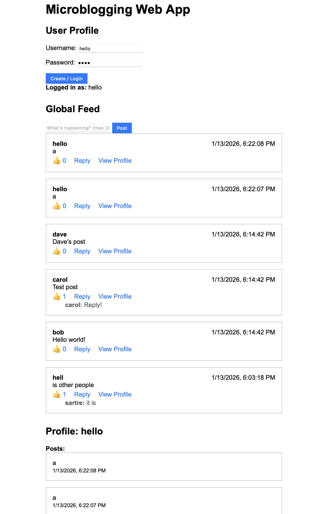

# Microblogging Web Application

A Twitter-like microblogging platform built with FastAPI (backend) and a static HTML/JS frontend.

## Features
- User profile creation
- Login/authentication
- Post short text updates (max 280 chars)
- Global chronological feed
- Like posts
- Reply to posts (one level deep)
- View user profiles and their posts

## Constraints
- No private messaging
- No retweets/reposts
- No follower graph

## Tech Stack
- Backend: FastAPI (Python)
- Frontend: Static HTML/JS (public/app.html, public/app.js)
- Database: SQLite
- Auth: JWT
- Logging: Python logging
- Testing: Pytest

## Setup
1. Backend: See backend/README.md
2. Frontend: Served as static files (public/app.html, public/app.js) via Docker or open app.html directly in browser.

## Usage
- Run `docker-compose build` to build containers.
- Run `docker-compose up` to start backend and frontend services.
- Access backend API at http://localhost:8000
- Access static frontend at http://localhost:3000/app.html

## Development
- All code is high quality, performant, and tested.
- Logging is enabled for key actions.

## License
MIT
# LLM-course
